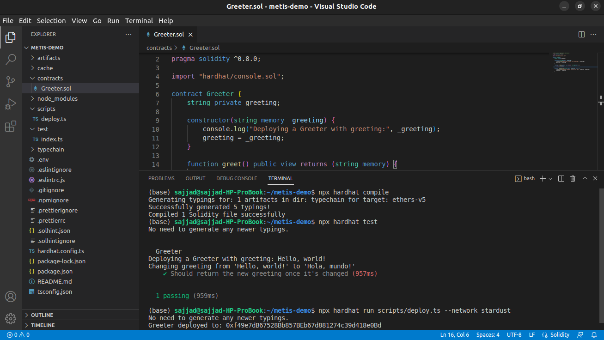
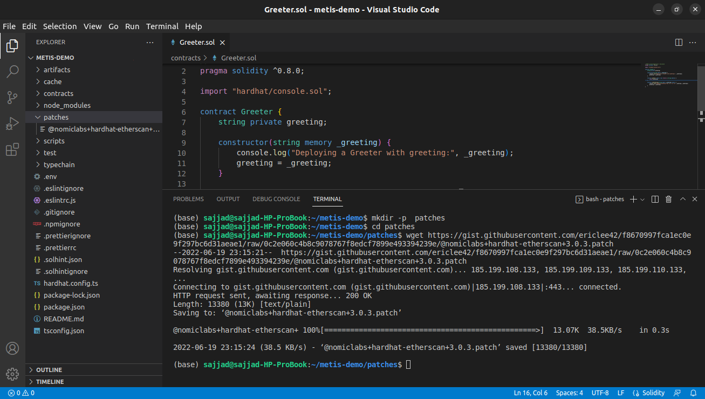

# Verifying Deployed Contracts on Metis

### Compile, Test, and Deploy Your Smart Contract <a href="#_vb5pw17j4e2y" id="_vb5pw17j4e2y"></a>

Open your project folder in VSCode, click on the `hardhat.config.ts` file and add the following settings to your project config file.

```javascript
const config: HardhatUserConfig = {
    solidity: "0.8.4",
    networks: {
        stardust: {
            url: "https://stardust.metis.io/?owner=588",
            accounts: process.env.PRIVATE_KEY !== undefined ? [process.env.PRIVATE_KEY] : [],
        },
        andromeda: {
            url: "https://andromeda.metis.io/?owner=1088",
            accounts: process.env.PRIVATE_KEY !== undefined ? [process.env.PRIVATE_KEY] : [],
        },
    },
    etherscan: {
        "api-key": "api-key"
    },
};
```

It should look like this, and you need to save the changes to compile, deploy, and verify your smart contract on the Stardust testnet. Make sure that you have updated your private key in the .env file.

>)

In order to verify your contract, first, check that your smart contract is ready to verify. Follow the steps below to see that your smart contract is ready and it needs a verification process.

Compile and deploy your smart contract on the Metis platform.



Use your MetaMask account to explore the latest account transactions.

 (1)>)

You can see the history of your transactions and smart contract deployment at the bottom of the page.

 (1)>)

Click on the last contract to see the details.

>)

In the new window, click on the contract address to explore the code and its verification status.

>)

You can click on the “Code” button and see that the last smart contract is not verified. So, we are going to take some steps to verify it and change the status to verified.

>)

Here you have 2 options for completing the process. You can use the Stardust explorer website to easily verify the smart contract that we are going to explain in the next sections. The second option is to use the hardhat-etherscan plugin.

Let’s start with the second option!

### Method 1: Verifying Using the Hardhat-etherscan <a href="#_a1dwahi9antp" id="_a1dwahi9antp"></a>

If you want to follow the hardhat instructions to verify contracts on the Metis platform, there is a very unique option. The Hardhat Etherscan plugin helps us perform the process in a few steps. Note that your hardhat-etherscan plugin version must be version 3.0.3 so that we can make use of the patch that adds support for Metis to use the hardhat-etherscan plugin.

Create your project in a new folder, deploy it on the Metis platform, and verify that it has been deployed successfully.

* If you haven't used this plugin, please read its[ documentation](https://hardhat.org/plugins/nomiclabs-hardhat-etherscan.html) first.

#### Step 1 <a href="#_8ny9fmq1vqwt" id="_8ny9fmq1vqwt"></a>

The hardhat etherscan plugin doesn’t support the Metis testnet, but there is a patch for hardhat-etherscan. You need to download the patch and apply it to your project. As a result, you will be able to use the hardhat-etherscan plugin to verify Stardust smart contracts.

First, make sure that the hardhat-etherscan plugin is version 3.0.3. If not, use the following commands in your terminal to switch to the right version. Now, you can check the hardhat-etherscan version using the package.json file.

```bash
$ yarn add -D @nomiclabs/hardhat-etherscan@3.0.3
```

>)

#### Step 2 <a href="#_2450fsslvqog" id="_2450fsslvqog"></a>

Now, we need to download the patch. Use the following commands to make a new folder that we use to store the patch.



#### Step 3 <a href="#_7g47wm8a2bx7" id="_7g47wm8a2bx7"></a>

Change the working directory to the main project directory (metis-demo), and use this command in the terminal to apply the patch.

```bash
$ yarn patch-package
```

 (1)>)

#### Step 4 <a href="#_z9vaiqicsmb5" id="_z9vaiqicsmb5"></a>

Copy the contract address from the Stardust explorer and use it in the code below. Note that the address must be the same as your smart contract address to be verified successfully.

```bash
$ npx hardhat --network stardust verify --contract contracts/Greeter.sol:Greeter 0xf49e7dB67528Bb857BEb67d881274c39d418e0Bd 'Hello, Hardhat!'
```

>)

 (1)>)

#### Step 5 <a href="#_okzaevxntgge" id="_okzaevxntgge"></a>

Here you can see the results after a successful verification process.

 (1)>)

### Method 2: Using the Stardust Explorer <a href="#_c9gw8b2b62bn" id="_c9gw8b2b62bn"></a>

#### Step 1 <a href="#_mwfo5whab4zs" id="_mwfo5whab4zs"></a>

```solidity
// SPDX-License-Identifier: MIT
pragma solidity ^0.8.4;

import "@openzeppelin/contracts/token/ERC20/ERC20.sol";
import "@openzeppelin/contracts/token/ERC20/extensions/ERC20Burnable.sol";
import "@openzeppelin/contracts/access/Ownable.sol";

contract MyToken is ERC20, ERC20Burnable, Ownable {
    constructor() ERC20("MyToken", "MTK") {
        _mint(msg.sender, 10000 * 10 ** decimals());
    }

    function mint(address to, uint256 amount) public onlyOwner {
        _mint(to, amount);
    }
}
```

Let’s create a smart contract and deploy it on the Metis platform.

 (1)>)

#### Step 2 <a href="#_mk5top3xdczv" id="_mk5top3xdczv"></a>

Click on the “Deploy” button to connect your MetaMask account and deploy the smart contract.

>)

#### Step 3 <a href="#_eo39r9aykwe6" id="_eo39r9aykwe6"></a>

Open Stardust explorer in MetaMask to see if the smart contract is deployed or not. Click on the contract to see the details.

 (1)>)

>)

>)

#### Step 4 <a href="#_x7bj14n9bidh" id="_x7bj14n9bidh"></a>

You can see that the smart contract is not verified, and we need to take a few steps to verify it. Click on the “Verify & publish” button.

 (1)>)

We want to verify the contract with flattened source code!

But, there are two more options if you want to try another method. Select the first option and click the next button.

 (1)>)

#### Step 5 <a href="#_toipv3tql8or" id="_toipv3tql8or"></a>

In this step, we need to complete some fields to verify the contract. But here, we must install the flattener plugin on the Remix IDE and get the flattened source code for the smart contract. Follow the screenshots below to install the flattener plugin.

 (1)>)

Choose the flattener plugin and click on the “flatten” button, and then save it to use for verifying the contract.

#### Step 6 <a href="#_ps4rl8owqf69" id="_ps4rl8owqf69"></a>

Go to the Stardust verify page and complete the fields. Note that the contract name, optimization option, and compiler version must be filled in correctly. Use flattened source code in the Solidity contract code field.

#### Step 7 <a href="#_j4kgohygm9yj" id="_j4kgohygm9yj"></a>

After completing the fields, you can click on the “Verify & publish” button. The process may take 1 minute or so to verify and publish your test smart contract. So, you need to be a bit patient.

Once completed, a new window appears, and you can see that your smart contract is now verified.

.png>)

You can scroll down and check the source code, contract ABI, etc.

.png>)

Please feel free to reach out to our [Help Center](https://metisdao.atlassian.net/servicedesk/customer/portals) if you have any technical questions.
